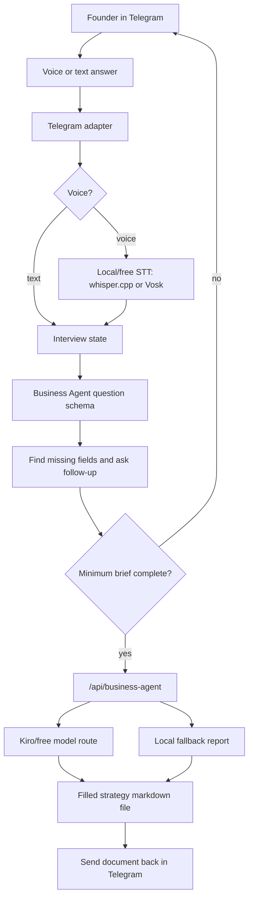

# Telegram Business Voice Bot

This document defines the missing target product around the reusable Business Agent core: a Telegram
voice bot that interviews a founder from zero and returns a filled business strategy file.

## User Outcome

The user speaks with a Telegram bot about a new business idea. The bot asks structured follow-up
questions, keeps the conversation in interview mode, and produces a filled markdown file with:

- Project Vault brief
- product description
- mission
- target audience and ICP
- CJM
- roadmap
- market opportunity
- go-to-market plan
- content plan
- risk checks
- 90-day action plan

## Source Inputs

The adapter must use the same `src/lib/businessAgent` schema used by the dashboard.

Project Vault CSV fields:

- name
- activity sector
- geography
- format
- project type
- current size
- product
- price segment
- solved tasks
- target audience

Google Sheet product-description pattern:

- update date
- source spreadsheet
- repo/product evidence
- product name
- one-line positioning
- primary offer
- paid offer
- rail or delivery layer
- what changed
- not the offer
- current runtime status
- next product gate

## Free-Only Architecture



No paid STT, paid LLM, payment rail, or hosted database is required for the default path.

## Interview Stages

1. Intake: name, sector, geography, format, project type, size.
2. Problem: painful job-to-be-done, urgency, current alternative.
3. Customer: target segment, budget context, decision trigger.
4. Product: first product, delivery format, differentiation, price.
5. Market: reachable customer count, pricing assumption, geography.
6. GTM: first 10 customers, channels, partnerships, founder-led sales.
7. Strategy: mission, CJM notes, roadmap milestones, content channels.
8. Review: bot summarizes answers and asks for corrections.
9. Export: bot calls Business Agent and returns the filled file.

## State Model

The adapter should persist one session per Telegram chat:

```ts
type TelegramBusinessSession = {
  chatId: string;
  answers: Partial<Record<BusinessAgentQuestionId, string>>;
  lastQuestionId?: BusinessAgentQuestionId;
  transcript: Array<{
    role: "bot" | "user";
    text: string;
    receivedAt: string;
  }>;
  status: "interviewing" | "reviewing" | "generating" | "complete";
};
```

SQLite is enough for local mode. The adapter can reuse OmniRoute's existing local database patterns,
but secrets such as `TELEGRAM_BOT_TOKEN` must stay in environment variables.

## Follow-Up Logic

The bot should ask one concise question at a time. It should not dump the whole questionnaire into
Telegram.

Priority order:

1. Required fields: business idea, problem, target customer, solution.
2. Project Vault fields needed for the filled brief.
3. Market math fields: market size assumption and price.
4. Strategy fields: mission, CJM notes, roadmap notes, content channels.
5. Evidence fields: traction, competition, constraints.

After every 4-6 answers, the bot should summarize what it understood and ask whether to continue or
correct something.

## Telegram Commands

- `/start` creates or resumes a session.
- `/brief` shows completed and missing fields.
- `/generate` generates the report if required fields are present.
- `/reset` clears the current interview.
- `/help` explains voice/text support and that the default path is free-only.

## Implementation Plan

1. Add a `telegram-business-agent` adapter package or service.
2. Read `TELEGRAM_BOT_TOKEN` from environment only.
3. Accept Telegram text messages and voice messages.
4. For voice, download the Telegram OGG file and transcribe through local/free STT.
5. Map transcript text into `BusinessAgentQuestionId` answers.
6. Ask the next missing question from `businessAgentQuestions`.
7. On `/generate`, call `/api/business-agent` with the session answers.
8. Save `filledFile.content` to a temporary `.md` file.
9. Send the file back to the user as a Telegram document.
10. Delete temporary files after delivery.

## Acceptance Criteria

- A founder can complete the required interview by voice or text.
- Paid model ids are rejected.
- If Kiro is disconnected, local fallback still returns a useful file.
- The returned file contains Project Vault brief, product description, mission, CJM, roadmap, target
  audience, content plan, market opportunity, and 90-day plan.
- The bot does not store secrets in Git and does not require paid infrastructure.
